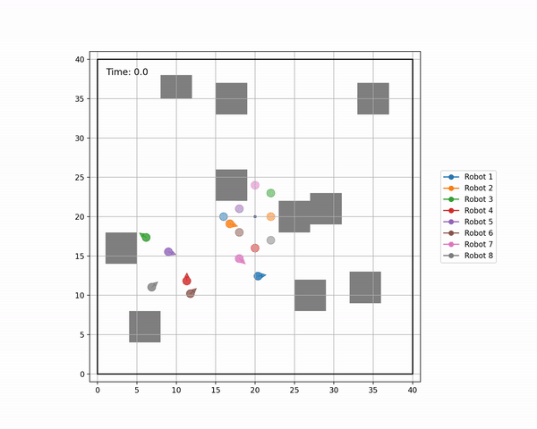

#  Adaptive path planner for swarm robots following a leader

## Liwei Yang, Manyung Emma Hon, Robert Kim, Zihan Qu, and Jet Situ

This repository is the final project for Carnegie Mellon University 16-782 Planning and Decision-making in Robotics. We are solving the path planning problem for a swarm of drones changing formations.

## Folder structure
```
├── formations -> stores the formation information
├── maps -> stores the start poses map
├── plans -> stores leader's predefined path
└── (output) -> stores the planner outputs
```

## Map
- map2.txt is for formation.py
- map1.txt is for cbs_rrt.py
- single_robot_map.txt is for rrt_mp.py

## Final result

### Formation CBS
```
python formation.py map2.txt plan1.txt formations
```



## Test each component

### CBS
```
python cbs_rrt.py map1.txt
```

### RRT
```
python rrt_mp.py single_robot_map.txt
```

### Visualizer
```
python visualizer_cbs.py map1.txt map1_output.txt
```